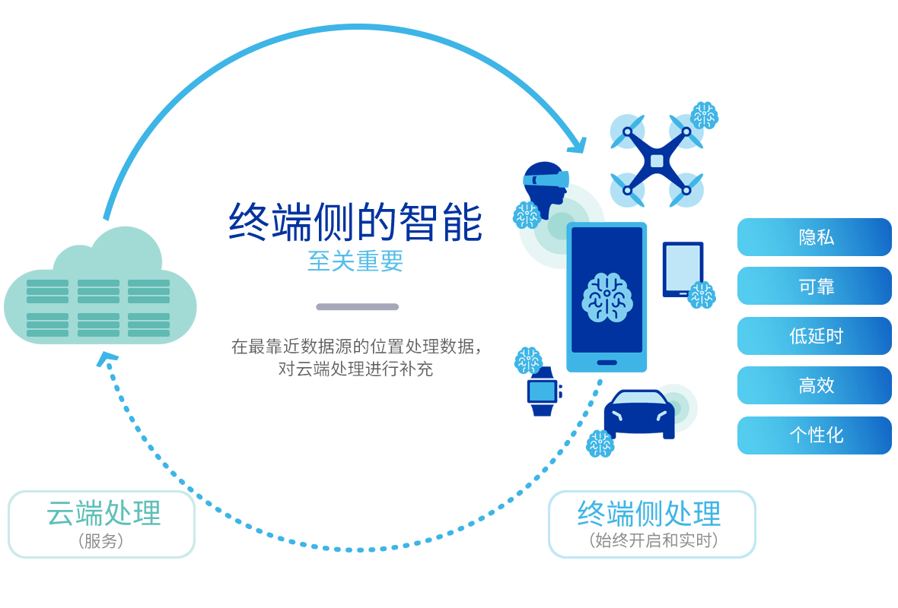

[English](./README.md) | 简体中文

深度学习框架教程
=============

**如何从零开始搭建一个深度学习框架?**

17年大学毕业后，我加入了vivo，至今一直在从事深度学习框架开发与端侧算法部署的工作。

我最早了解深度学习，是从Tensorflow、Caffe开始，受限于算力与功耗，当时大部分算法还是部署在云端的，随着以Mobilenet、ALBERT系列为代表的端侧轻量化算法（包括剪枝、NAS等技术）的涌现，以及端侧处理器的算力不断增加，越来越多的算法开始部署到端侧，如人脸解锁、视频超分、漫画特效、离线ASR、机器翻译等。

相较于部署在云端的算法，端侧算法具有如下优势（图片来源于https://www.qualcomm.cn/on-device-ai/details）：

把在云端训练的深度学习算法，集成到相机、相册、浏览器等应用/客户端中，并以各种各样的形式展示给终端用户，这个过程就需要依赖深度学习框架。

对于刚接触深度学习框架的同学来讲，其中涉及到的内容太多了，同时可能会有诸多疑问，例如：

- 模型文件是如何存储计算图的？
- 不同模型之间是如何转换的？
- 架构设计应该考虑哪些问题？
- CPU、GPU、DSP等处理器的计算优化是如何实现的？
- ...

本教程旨在通过实现一个简易版深度学习框架，帮助读者逐步理解各模块的实现原理和方法

如何使用本教程
===========

本专栏主要分为以下几个章节：

1. [深度学习框架总览](../chapter01-overview/README_cn.md)

第一章节以介绍主流深度学习框架为主，从第二章开始，我们会进入实战环节——从0开始搭建深度学习框架，与此同时，我们会开发一个具备相册分类 (算法的训练框架为Tensorflow)功能的APP，并用我们开发的这个计算框架实现相册分类算法在端侧的部署与加速。

完成该任务所需基础知识与技能：

- Python/C++/Java 编程基础，Android开发基础
- 掌握至少一种训练框架：Tensorflow、Caffe等
- 至少了解Protocol Buffer和FlatBuffer中的一种数据交换格式及其基本用法
- 至少掌握Neon、OpenCL、OpenGL ES、HVX中的一种计算优化技术

贡献
===

本教程是个人利用业余时间编写的，在进度上可能偶尔会拖延，但是我希望能在今年完成。

同时也欢迎大家指出文档/代码的问题，提交PR。